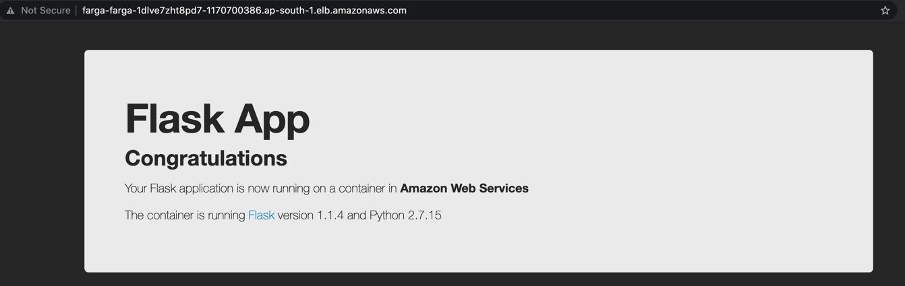
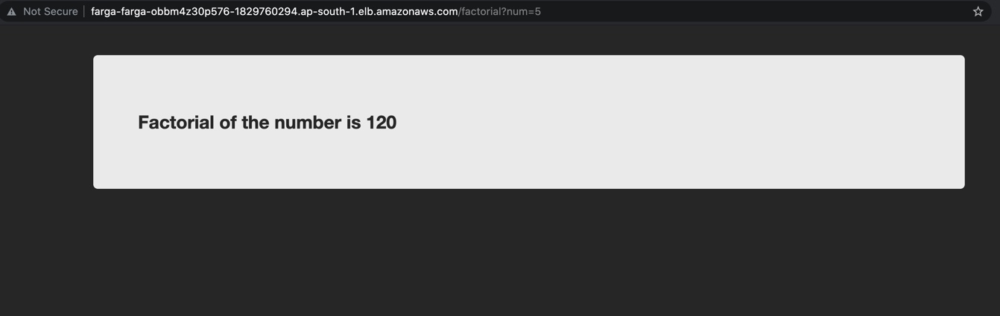

# Repo1-cdk-factorial-rest-service
## _This repo has following components_
 _1. REST service backed by python flask app._
 _2. REST service is deployed on AWS ECS service, with fargate variant, and Application load balancer on own VPC exposed using NAT gateway._

## Features
- Python flask rendering HTML template. 
- Landing page acting as health check URL.
- Factorial can be calculated by passing the query param /factorial?num=<Non Negative Integer>


## Tech

- [Python] - Application language for lambda!,CDK for CICD.
- [AWS services] - ECS Fargate,VPC subnet,Application load balancer,NAT Gateway.

## Installation

App requires [Python 3](https://www.python.org/downloads/) to run.

Local environment bootstrapping to start the application
```sh
python3 -m venv .venv # To manually create a virtualenv on MacOS and Linux
source .venv/bin/activate # activate the virtualenv in mac
.venv\Scripts\activate.bat # activate the virtualenv in windows
pip install -r requirements.txt # install all the python dependencies
```

For deployment into aws environment

```sh
 cdk ls          list all stacks in the app
 cdk synth       emits the synthesized CloudFormation template
 cdk deploy      deploy this stack to your default AWS account/region
 cdk diff        compare deployed stack with current state
 cdk docs        open CDK documentation
```

> Note: Application is not deployed as NAT gateways is charged per hour and dint want to incur any costs.

Sample application screen shots for reference.



